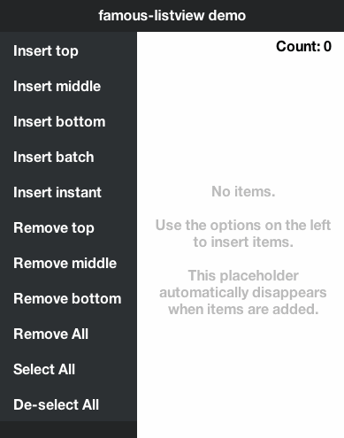

famous-listview
==========

### *This project is no longer actively maintained. A new project called [famous-flex](https://github.com/IjzerenHein/famous-flex) was started which contains the more powerful [FlexScrollView](https://github.com/IjzerenHein/famous-flex/blob/master/tutorials/FlexScrollView.md) and much more features.*

famous-listview is a fully customizable list-view which extends famo.us ScrollContainer with:
* insert/remove animations
* selection state (single / multiple)
* showing a placeholder when the list is empty



## Demo

[View the demo here](https://rawgit.com/IjzerenHein/famous-listview/master/examples/demo/index.html)


## Installation

Install using bower:

	bower install ijzerenhein/famous-listview

## Getting started

If necessary, add to the requirejs paths config:

```javascript
require.config({
    paths: {
        ...
        'famous-listview': 'bower_components/famous-listview/ListView',
        ...
    }
});
```

Example of how to create a ListView:

```javascript
var ListView = require('famous-listview');

// create list-view
var listView = new ListView();
this.add(listView);

// insert items with height 40
listView.insert(0, new Surface({ size: [undefined, 40], content: 'one' }));
listView.insert(1, new Surface({ size: [undefined, 40], content: 'two' }));
listView.insert(-1, new Surface({ size: [undefined, 40], content: 'three' }))); // -1 => appends at tail

// handle selection events
listView.on('selection', function (event){
	var surface = listView.get(event.select[0]); // get newly selected surface
	console.log('Surface was clicked: ' + surface.content);
});
```

## Documentation

- [Inserting and removing](#inserting-and-removing)
- [Events](#events)
- [Selection](#selection)
- [Views, surfaces and state-delegation](#views-surfaces-and-state-delegation)
- [Animations](#animations)
- [Placeholder to show when list is empty](#placeholder-to-show-when-list-is-empty)
- [Orientation](#orientation)
- [Setting internal margins](#setting-internal-margins)
- [API Reference](docs/ListView.md)
- [Options](docs/ListView.md#module_ListView)

### Inserting and removing

To insert or remove items, use the `insert` and `remove` methods. When `-1` is
used in combination with the `index` it refers to the last + 1 item. When `-1`
is used in combination with the `count` then it refers to all items, starting
from `index`.

**Insert examples**
```javascript
listView.insert(0, renderable);                // Insert before the first item
listView.insert(-1, renderable);               // Insert after the last item
listView.insert(4, [renderable, renderable2]); // Insert two items at once
listView.insert(0, renderable, {duration: 0}); // Insert without animation

// Insert two items slowly, and with a callback
listView.insert(0, [renderable, renderable2], {duration: 3000}, function() {
	console.log('yay, the animation has completed');
});
```

**Remove examples**
```javascript
listView.remove(0);                            // Remove the first item
listView.remove(1, 3);                         // Remove 3 items starting at 1
listView.remove(0, -1);                        // Remove all items
listView.remove(-1, 10);                       // Remove last 10 items
listView.remove(0, -1, {duration: 0});         // Remove without animation

// Remove all items slowly, and with a callback
listView.remove(0, -1, {duration: 3000}, function() {
	console.log('yay, the animation has completed');
});
```

### Events

The following events are emitted by the view:

```javascript
listView.on('selection', function (event) {
	/* when multiple items selected at once, 'selection' is only emitted once
	event: {
		type,     // event-type: 'selection'
		select,   // array containing the indexes of the newly selected items
		deselect, // array containing the indexes of the now deselected items
		target    // listView
	} */
});

listView.on('insert', function (event) {
	/* when multiple items are inserted at once, insert is only emitted once
	event: {
		type,     // event-type: 'insert'
		index,    // index of first inserted item
		count,    // number of items that were inserted
		target    // listView
	} */
});

listView.on('remove', function (event) {
	/* when multiple items are removed at once, remove is only emitted once
	event: {
		type,     // event-type: 'remove'
		index,    // index of first removed item
		count,    // number of items that were removed
		target    // listView
	} */
});
```

### Selection

ListView supports 3 selection modes: `Selection.NONE`, `Selection.SINGLE` and
`Selection.MULTIPLE`. Because the list-view does not inject any own surfaces
into the render-tree, it utilizes the inserted renderable for capturing the
`click` event. **For selection to work, the renderable must have an
`.on` function and respond to the `click` event.**

By default, the selection-mode is set to **SINGLE**. To change the
selection-mode use:

```javascript
var listView = new ListView({
	selection: ListView.Selection.MULTIPLE
});
```

To get the selection use `getSelection`

```javascript
var renderables = listView.getSelection();    // returns array of renderables
var indexes = listView.getSelection(true);    // returns array of indexes
```

To set the selection use `setSelection`:

```javascript
listView.setSelection(0);                     // selects the first item
listView.setSelection(0, 1, true);            // equivalent to setSelection(0)
listView.setSelection(-1);                    // selects the last item
listView.setSelection(0, 10);                 // selects the first 10 items
listView.setSelection(0, -1);                 // selects all items
listView.setSelection(0, 1, false);           // de-selects the first item
listView.setSelection(0, -1, false);          // de-selects all items
```

### Views, surfaces and state-delegation

Any renderable can be inserted into the list-view. When a `Surface` is added,
the list-view automatically adds and removes the following classes: `first`,
`last` and `selected`. This makes it possible to render the `Surface`
differently based on its state (e.g. add rounded corners). This is the default
behavior of the list-view and is performed by the `ListView.setSurfaceClass`
function which calls `addClass` and `removeClass` on the renderable.

When using Views instead of Surfaces, you can specify a custom function
`options.setItemState` for delegating the state to the view (e.g. for
rendering the view differently when it is selected).

```javascript

// delegate selection-change to the view
function _setViewState(index, view, state, set) {
	if (state === ListView.ItemState.SELECTED) {
		view.setSelected(set);
	}
}
listView = new ListView({
	setItemState: _setViewState
});

// insert view (view has method: setSelected)
listView.insert(0, new MyView());
```
### Animations

The insert and delete animations can be configured using the options:

```javascript
var listView = new ListView({

	// expand/collapse size
	insertSize: [undefined, 0],                                       // start of size when inserting
	removeSize: [undefined, 0]                                        // end of size when removing
	insertSizeTransition: {duration: 300, curve: Easing.outCirc},     // size-transition used when inserting
	removeSizeTransition: {duration: 200, curve: Easing.outExpo},     // size-transition used when removing

	// opacity show & hide
	showOpacity: 1,                                                   // opacity after insert
	insertOpacity: 0,                                                 // start of the opacity when inserting
	removeOpacity: 0,                                                 // end of the opacity when removing
	insertOpacityTransition: {duration: 300, curve: Easing.inQuad},   // opacity-transition used when inserting
	removeOpacityTransition: {duration: 200, curve: Easing.outQuad},  // opacity-transition used when inserting

	// transform (example below shows a slide-in effect)
	showTransform: null,                                              // transform after insert
	insertTransform: Transform.translate(300, 0, 0),                  // start transform when inserting
	removeTransform: Transform.translate(-300, 0, 0)                  // end transform when removing
	insertTransformTransition: {duration: 500, curve: Easing.outQuad},// transform-transition used when inserting
	removeTransformTransition: {duration: 500, curve: Easing.inQuad}, // transform-transition used when removing
};
```

### Placeholder to show when list is empty

You can set a placeholder, which is shown when the list is empty.

```javascript
var listView = new ListView();
var placeholderModifier = new Modifier({
	align: [0.5, 0.5],
	origin: [0.5, 0.5]
});
var placeholderSurface = new Surface({
	size: [undefined, true],
	content: 'No items'
});
listView.placeholder.add(placeholderModifier).add(placeholderSurface);
```

The show and hide animation can be configured through the following options:

```javascript
var listView = new ListView({
	showPlaceholderTransition: {duration: 500},
	hidePlaceholderTransition: {duration: 500}
});
```
### Orientation

By default, the listview lays-out its renderables from top to bottom. To layout
the renderables from left to right use:

```javascript
var listView = new ListView({
	scrollContainer: {
		scrollview: {
			direction: Utility.Direction.X
		}
	},
	insertSize: [0, undefined], // start of animation when inserting
	removeSize: [0, undefined]  // end of animation when removing
});
```

And the renderable that is added to the ListView must have its width defined:

```javascript
listView.insert(new Surface({
	size: [40, undefined]
}));
```

### Setting internal margins

By default, the Scrollview inside the ContainerSurface is filled to
its parent. To set margins between the added items and the parent container,
use:

```javascript
var listView = new ListView({
	scrollContainer: {
		container: {
			properties: {
			    padding: '10px'
			}
		}
	}
});
```

## Contribute

Feel free to contribute to this project in any way.
The easiest way to support this project is by giving it a star.

## Contact
- 	@IjzerenHein
- 	http://www.gloey.nl
- 	hrutjes@gmail.com

© 2014 - Hein Rutjes
